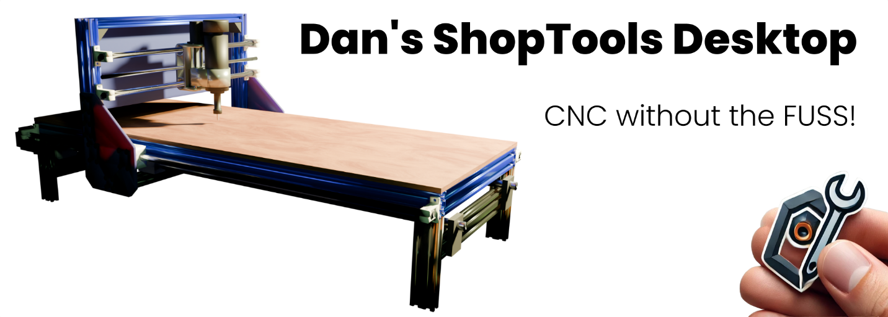
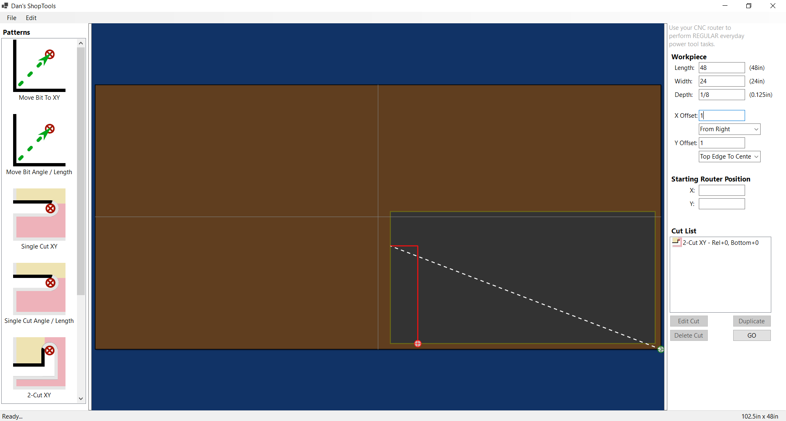

One of the biggest complaints I've heard about CNC routers in recent
years is that, even when you want to use your machine for simple ad-hoc
drills and cuts, the time it takes to plan everything out, draft it in
your favorite CAD application, and create your tool paths with a
matching CAM application often outweighs the convenience. You could have
saved time by just walking over to your traditional power tools and
doing it manually. But that's about to change…

Welcome to **ShopTools**, the application that finally makes CNC routing
easier than using your old power tools - except now, you don’t have to
touch those tools at all. That’s right: with no CAD, no CAM, no
expensive software or steep learning curve - you can just **drag,
drop,** and **cut**.

&nbsp;

## Why ShopTools?

Have you ever wished your CNC router could just **replace** your power
tools instead of adding another layer of complexity? Well, **wish
granted**. ShopTools is here to make your CNC pay for itself by taking
over the following jobs.

-   **Drill Press**. Precisely placed holes, no measuring required.

-   **Table Saw / Miter Saw**. Straight cuts, perpendicular or at any
    angle.

-   **Band Saw**. Curve? No problem.

-   **Scroll Saw**. Intricate, detailed work with machine precision.

-   **Jigsaw / Sabre Saw**. For the times you just need a quick,
    accurate cut.

&nbsp;

## How It Works

Imagine defining your cuts *faster than you could mark them with a
straightedge and pencil*. That’s what ShopTools delivers. No marking. No
CAD. No CAM. No tool-path configurations. You just accurately position
your material on the waste board, and your CNC does the rest.

-   **Use any numbering system**. Every measurement textbox supports
    every popular distance-type measurement expression. You can specify
    inches and fractions of an inch for one parameter, while using
    decimal inches or millimeters for another.

-   **Template-driven workflow**. Just drag and drop movements, drill
    positions, and cut lines into place.

-   **No job is too simple**. Even if you only need to drill one hole or
    make one cut, this is the perfect way to get it perfect the first
    time every time.

-   **Lines at any angle**. Set a couple of parameters and go.

-   **Save and reuse cut lists**. Open, edit, and export to G-code
    whenever you need.

-   **One-time table setup**. Just set your dimensions, directions of
    travel, and origins. Done.

-   **Check your cuts before exporting.** You can now review your cuts
    on a scale-model orthogonal 3D view of your table.

&nbsp;

## The Safest Way to Run Your Shop

Why get your hands near a spinning blade when you don’t have to? With
ShopTools, the only time you touch the machine is when you’re
**calibrating it, turning it on,** or **turning it off**. Everything in
between is hands-free. Faster cuts, safer operation, and zero risk of
kick-back or touching rotating equipment.

&nbsp;

## But Wait, There's More

Improvements are coming along pretty rapidly but if you encounter
something that hasn't been addressed, just add an Issue and we'll make
sure it gets some attention.

So, what’s stopping you? Your CNC is ready to go to work. **Why not let
it?**

Download ShopTools today and make your shop run smoother than ever.

&nbsp;

## Installing ShopTools

For the best results, follow these steps to download and install the
current version of ShopTools.

-   In the right-hand column of this page, locate and click the
    **Latest** entry in the **Releases** section.

-   Read the release notes and scroll to the bottom of the section.

-   In the **Assets** section, click **ShopToolsSetup.exe**.

-   If you see a Downloads warning message stating that
    **ShopToolsSetup.exe isn't commonly downloaded, make sure you trust
    ShopToolsSetup.exe before you open it**, click the meatball menu
    next to the filename and click **Keep**.

    -   In the **Make sure you trust ShopToolsSetup.exe before you open
        it** dialog, click **Show more**, then click **Keep anyway**.

-   Open Windows File Explorer in your Downloads folder, and right-click
    **ShopToolsSetup.exe**.

-   From the context menu, select **Properties**.

-   Check **Unblock**.

-   Click **OK**.

-   Double-click ShopToolsSetup.exe to run the installat*on.*

&nbsp;

### More Information

Since ShopTools Desktop is just a young application, it doesn't yet have
much of a world-wide reputation. As a result, Microsoft products like
Edge and Teams might warn you that since this application isn't
downloaded very much, you should make sure you trust it before
installing it. They will likely also cause you to take several
additional unnecessary steps to get the software installed to make sure
you really intend to place it on your PC.

&nbsp;

### Reporting the Setup File as Safe

If you have already learned to trust ShopTools and want to help build
its reputation so other users don't have to perform additional
installation steps, you can select the option to **Report this file as
safe** on the meatball menu next to the warning **ShopToolsSetup.exe
isn't commonly downloaded, make sure you trust ShopToolsSetup.exe before
you open it**.

When you select **Report this file as safe**, you are directed to the
Microsoft SmartScreen website where you can check **I think this is a
safe website**.

&nbsp;

## Our Commitment to Security, Privacy, and Transparency

With ShopTools, our mission is to provide users with a powerful and
efficient tool to enhance their productivity - nothing more, nothing
less. We understand the importance of trust when it comes to using
third-party software, and we take this responsibility seriously.

### Security and Integrity

When we compile and distribute ShopTools Desktop, we follow rigorous
security protocols to ensure that our application does not pose any risk
to your computer. We are committed to delivering a product that is safe,
stable, and free of malicious components. To guarantee the authenticity
of our software, every official release is securely code-signed by
**Daniel Eric Patterson**. This authentic digital signature, issued by
SSL.com, ensures that the version you install is an unaltered, original
copy, free from any unauthorized modifications.

### Your Privacy Matters

We firmly believe that your data is yours alone. ShopTools **<u>does
not</u>** collect, store, or transmit any personal information - period.
Any data you generate, process, or exchange using our application
remains entirely under your control. We have no access to it, nor do we
ever attempt to monitor or retrieve it in any way. Our software is
designed to work locally on your machine, ensuring complete privacy and
peace of mind.

### Open Source for Transparency

To further reinforce our commitment to security and user trust,
ShopTools is proudly open source. Our code is available for review on
the GitHub **DanielAnywhere/ShopTools** repository. We encourage anyone
in the community to inspect, audit, and verify that our software is
exactly what we claim it to be - safe, transparent, and trustworthy. By
making our source code publicly accessible, we aim to foster an open
dialogue with users and developers alike, ensuring that ShopTools
remains a reliable tool for all.

Thank you for choosing ShopTools. Your trust and security are our top
priorities, and we are dedicated to maintaining the highest standards of
integrity in everything we do.

&nbsp;

## Using ShopTools

The general workflow of using ShopTools is easy.

The following are the general steps for creating No-CAD / No-CAM cuts on
your CNC router:

-   Open ShopTools. If this is the first time opening the application,
    choose the **Edit / Settings** menu option to configure your table.
    This only needs to be done once.

-   Set the Length, Width, and Depth of your workpiece. Optionally,
    position the workpiece and router at known offsets.

-   Double-click a pattern or drag and drop it onto your work area, and
    set the properties like starting offset, length, angle, or whatever
    is applicable for the operation.

-   Repeat the above steps until all holes and cuts are defined.

-   Save your cut-list file if you wish to refer back to it later.
    Whenever you open a cut-list file you've saved earlier, you only
    need to export it to g-code to use it, skipping all of the above
    steps.

-   Export your file to g-code and pass that file to your machine.

&nbsp;

NOTE: Although the feature is planned, ShopTools doesn't yet have a
real-time 3D toolpath preview. If you like to review your toolpaths as a
general rule before sending them to your machine, I would recommend
using <https://ncviewer.com/> by ToolPath Labs.

&nbsp;

## Developing With ShopTools

You can see the full SDK documentation for ShopTools here on the GitHub
site at <https://danielanywhere.github.io/ShopTools>.

&nbsp;

## Platform Independence, Anyone?

If you would like to see a non-Windows (Linux UI) version of this
application, please provide some feedback on the Issues page of this
repository so I can get an indication of whether the effort might be
worthwhile.
